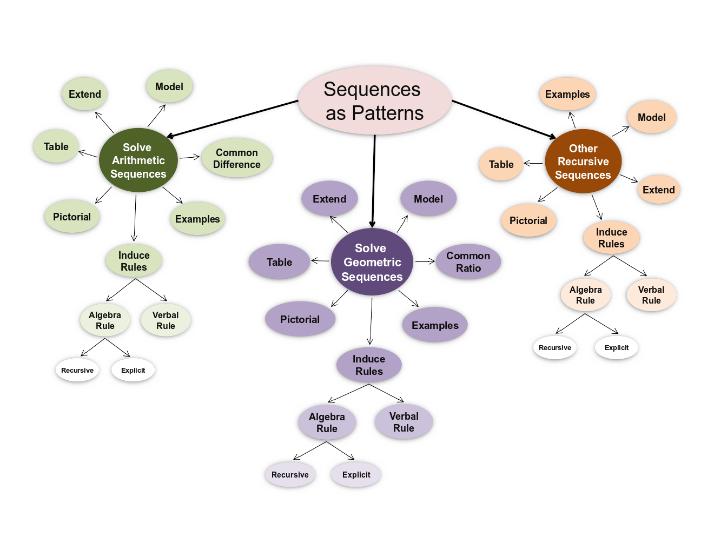

## Graphical Structure

The full ACED proficiency model has three separate branches for
arithmetic, geometric and other recursive sequences. Only the middle
branch was used in the Evaluation. Thus although 'Sequences' is the top
node in the model 'Solve Geometric Problems' was treated as if it was
the top.

This is a hierarchical breakdown, and a reasonable approximation to this
model could be made by reducing the number of levels in each hierarchy.

This was realized in ACED as a Bayesian network, where each variable can
take on three states: `High`, `Medium` or `Low`. It is a tree structured
model where each variable has exactly one parent.

Note that there were a series of tasks tapping the 'Solve Geometric
Problems' task that turned out to really be about recognizing geometric
sequences. This indicates that there may be a missing node in the model.

## Joint probability distribution

*Unconditional Probabilities*

| *Variable* | *High* | *Medium* | *Low* |
|------------|--------|----------|-------|
| Sequences  | 0.20   | 0.50     | 0.30  |

Note that the conditional probability tables were created through a
number of "regressions" in which the Math Expert specified the
correlation and intercept for the regressions. These are presented
below. (I've lost the original numbers and need to back translate them
from the conditional probability tables. This is a relatively
straightforward process, simply treat it as weighted regression with the
conditional probabilities as the weights, but I haven't had a chance to
do that yet.)

*Conditional Probabilities*

| *Parent*                 | *Child*                  | *Correlation* | *Intercept* |
|--------------------------|--------------------------|---------------|-------------|
| Sequences                | Recognize Sequences      |               |             |
| Recognize Sequences      | Distinguish Types        |               |             |
| Sequences                | Solve Sequence Problems  |               |             |
| Solve Sequence Problems  | Solve Geometric Problems |               |             |
| Solve Geometric Problems | Common Ratio             |               |             |
| Solve Geometric Problems | Examples Geometric       |               |             |
| Solve Geometric Problems | Extend Geometric         |               |             |
| Solve Geometric Problems | Model Geometric          |               |             |
| Solve Geometric Problems | Table Geometric          |               |             |
| Solve Geometric Problems | Visual Geometric         |               |             |
| Solve Geometric Problems | Induce Rules Geometric   |               |             |
| Induce Rules Geometric   | Verbal Rule Geometric    |               |             |
| Induce Rules Geometric   | Algebra Rule Geometric   |               |             |
| Algebra Rule Geometric   | Explicit Geometric       |               |             |
| Algebra Rule Geometric   | Recursive Rule Geometric |               |             |

The complete set of conditional probability tables for this model are
given in [The Proficiency
Model](StatShop/AMDF/THE__Understands__Sequences__as__Patterns.html).

ACED development and data collection was sponsored by National Science
Foundation Grant No. 0313202.
